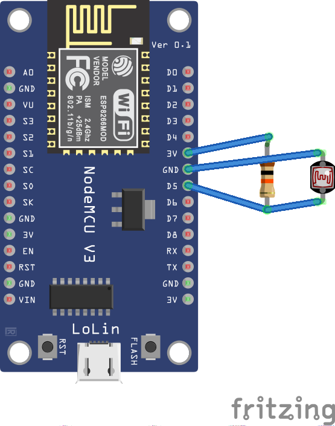

# logarex-obis-powermeter
PlatformIO/Arduino project to read out OBIS values from a Logarex meter using ESP8266 and a custom IR reading head.

## Hardware
* ESP8266 (NodeMCU)
* Phototransistor (SFH 309 FA)
* 10k ohm resistor
* 3d printed reading head (https://www.printables.com/model/274592)



## Software

### Setup

1. Open project using [PlatformIO](https://platformio.org)
1. Make sure to have the following libraries installed
   1. WifiManager
   2. ESP8266WebServer
1. Adjust constants in `main.cpp` according to your needs
   * `HOSTNAME` is the name of the device within your network
   * `INPUT_PIN` is the pin you've connected your IR reading head to
1. Upload everything to your device

### First start

Upon first start, the device will create a new access point named after the contents of `HOSTNAME`. Connect to this WiFi network and open the IP `192.168.4.1` in your browser. A web page allows to configure the connection to any available network.

Once the device is connected to a network, it will start publishing the OBIS values via JSON using the embedded webserver.
Connect your browser to `http://<IP of device>` to receive the following output:

```
{"total":13333.2947}
```
